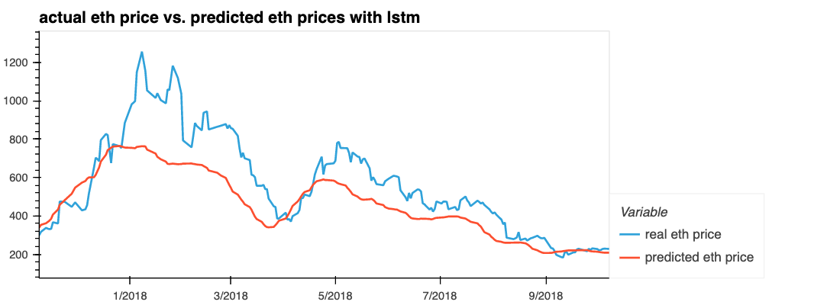

# Group Project 2

## Table of Contents

1. Hypothesis
2. Data Collection and Clenaing
3. Choices for models & Perfromance
4. Contributions

## Hypothesis

- We use machine learning tools to predict the price of ethereum from historical data, economic indicators, and community sentiment on ethereum specifically from twitter.
- We test this hypothesis by building LSTM and GRU models

## Data Collection & Cleaning

- Our Sources were: 
    - [Twint Protocol](https://github.com/twintproject/twint) for Collecting tweet data 
    - [OWlracle API](https://owlracle.info/eth) for collecting Gas price history 
    - [Kaggle](https://www.kaggle.com/datasets/varpit94/ethereum-data) for ETH to USD Historical Data 
    - FRED for personal savings percentage data 
    - Market Watch for S&P 500 historical data

## Choices for models

- We used two models to predict the price of ethereum
    - Long Short-Term Memory (LSTM) model from keras
    - Gated Recurrent Unit (GRU) model form keras

- Spliting our data to train and test 

## Contributions

- [Meek Msaki](https://github.com/mmsaki)
    - Get historical gas prices and clean data.
    - Set up and run LSTM model

- [Kyle Plathe](https://github.com/kyleplathe)
    - Get historical eth prices and clean data
    - Get S&P 500 historical
    - Get US savings historical data
    - Set up GRU model 

- [Richard Melvin](https://github.com/rgmelvin)
    - Get historical sentiment for ethereum 2017 - 2020
    - Twitter api sentiment analysis with nltk and vader
    - Perfromed PCA analysis

- - -
